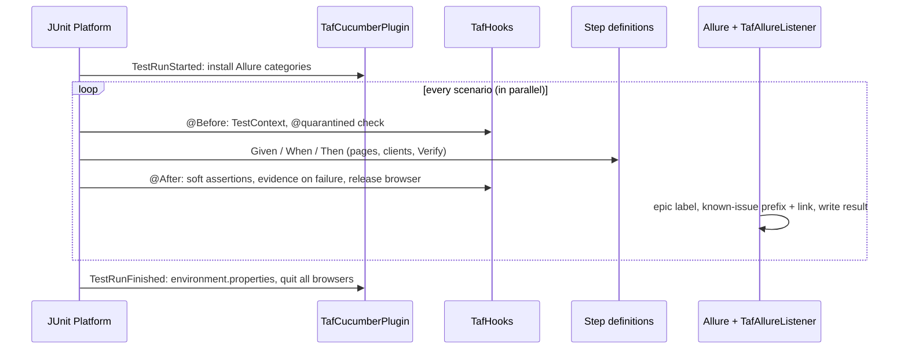

# Architecture

## Modules

| Module | Contains |
|---|---|
| `taf-core` | Hooks, Cucumber plugin, Allure listener, web layer, API layer, config, failure taxonomy, `Verify`, linter. Unit-tested without a browser (Mockito). |
| `examples` | Features, step definitions, page objects and API clients for the demo targets. |

## Packages of `taf-core`

```
config/    TafConfig (layered config), RuntimeOverrides, SecretsGuard
context/   TestContext (current scenario, soft assertions), ScenarioContext (shared step state, injected)
hooks/     TafHooks (scenario lifecycle), TafCucumberPlugin (run lifecycle)
tags/      Tags (@name=value), Quarantine
allure/    TafAllureListener (epic, known issues), AllureResults (categories, environment)
web/       BrowserFactory, DriverManager, Page, Component, ComponentList, UiElement(s), PageFactory,
           @Locate, @PageIdentifier, @WaitFor, @Url, LocatorResolver, Waits, WebEvidence
http/      ServiceClient, auth/ (AuthProvider + none/bearer/api-key/basic/oauth2)
users/     TestUsers, UserCredentials
failure/   failure taxonomy        verify/, log/, report/   Verify, Log, report helpers
lint/      FeatureLinter
```

## Lifecycle



## Design decisions

- **One browser per thread, started lazily.** API scenarios cost no browser start, and parallel scenarios never share one.
- **Lazy, re-located elements.** A `UiElement` stores *how* to find an element, never a `WebElement`. This avoids
  stale references and implicit waits.
- **Names everywhere.** Elements know `Page.field[index]`, so failures and report steps explain themselves.
- **Tags as metadata.** Ownership, epics, severity, known issues and quarantine live next to the scenario,
  checked by the linter.
- **Evidence over logs.** Screenshot, URL and HTML are attached where the failure is.
